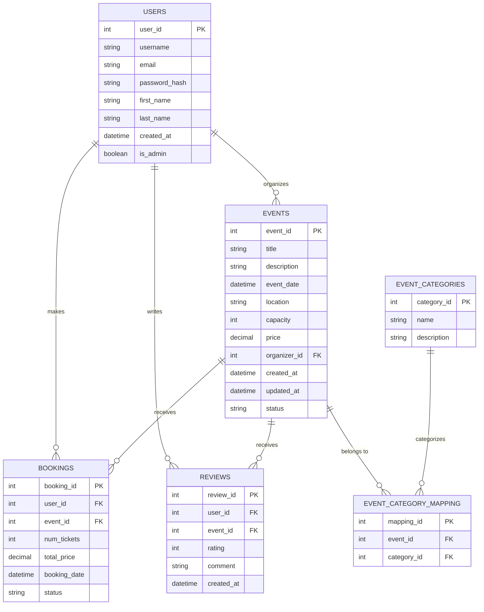

```mermaid
erDiagram
    USERS {
        int user_id PK
        string username
        string email
        string password_hash
        string first_name
        string last_name
        datetime created_at
        boolean is_admin
    }
    
    EVENTS {
        int event_id PK
        string title
        string description
        datetime event_date
        string location
        int capacity
        decimal price
        int organizer_id FK
        datetime created_at
        datetime updated_at
        string status
    }
    
    EVENT_CATEGORIES {
        int category_id PK
        string name
        string description
    }
    
    EVENT_CATEGORY_MAPPING {
        int mapping_id PK
        int event_id FK
        int category_id FK
    }
    
    BOOKINGS {
        int booking_id PK
        int user_id FK
        int event_id FK
        int num_tickets
        decimal total_price
        datetime booking_date
        string status
    }
    
    REVIEWS {
        int review_id PK
        int user_id FK
        int event_id FK
        int rating
        string comment
        datetime created_at
    }

    USERS ||--o{ EVENTS : "organizes"
    USERS ||--o{ BOOKINGS : "makes"
    USERS ||--o{ REVIEWS : "writes"
    EVENTS ||--o{ BOOKINGS : "receives"
    EVENTS ||--o{ REVIEWS : "receives"
    EVENTS ||--o{ EVENT_CATEGORY_MAPPING : "belongs to"
    EVENT_CATEGORIES ||--o{ EVENT_CATEGORY_MAPPING : "categorizes"
```
